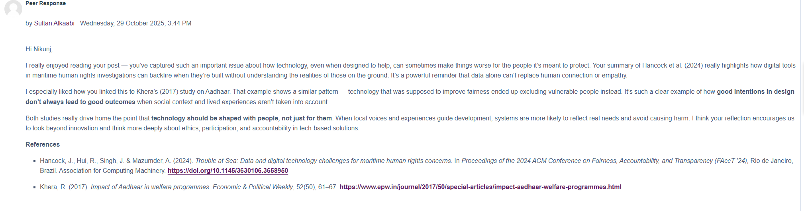
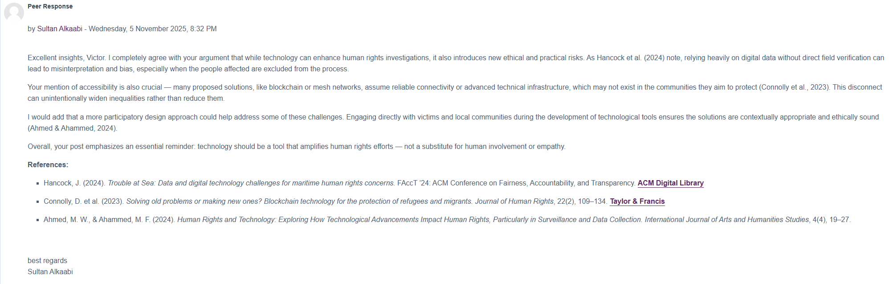

## Unit 2 – Users, Assessments and the Risk Management Process

### Unit Overview  
Unit 2 develops a deeper understanding of the Risk Management Process (RMP) by examining the differences between qualitative and quantitative risk assessment approaches and the importance of user participation. The unit highlights how assessment choices influence risk prioritisation and decision-making, and why stakeholder involvement is critical to producing meaningful and actionable risk outcomes within organisations.

---

### Artefacts  

**Initial Discussion Post**  
This screenshot shows my initial discussion contribution analysing the differences between qualitative and quantitative risk assessments and explaining the importance of user involvement in the RMP.

**Peer Responses**  
The following screenshot demonstrates my engagement with peers, where I critically responded to their views and supported my arguments using academic sources.

**Seminar Preparation / Workshop Activity**  
I prepared written responses for the Unit 2 seminar, focusing on how different assessment approaches and user participation affect the effectiveness of the risk management process.

---

### Individual Contribution  
I authored the initial discussion post comparing qualitative and quantitative risk assessment methods and explaining the role of users in shaping risk identification and mitigation. I also responded to peers with academically supported arguments and completed the seminar preparation activities, demonstrating independent engagement with the unit content.

---

### Critical Reflection  
Unit 2 reinforced that risk assessment is not purely a technical exercise but a socio-technical process shaped by stakeholder input. I learned that qualitative methods are particularly valuable when historical data is limited, while quantitative approaches pro
